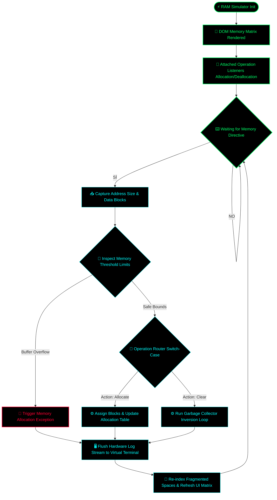

# Volatile RAM Buffer Simulator Engine 💾

A low-latency virtual memory allocation and buffer management simulator built in native JavaScript. This repository demonstrates dynamic memory block addressing, fragmentation calculation loops, and real-time volatile stack visualization with zero processing lag.

## 🗂️ Architectural Overview

The simulation environment acts as a deterministic memory controller, capturing memory write/read operations, validating block boundaries, and processing memory deallocation algorithms through a modular state-update engine.

### ⚙️ Core Technical Features:
* **Volatile Stack Virtualization:** Simulates memory block distribution and addressing metrics instantly via isolated execution loops.
* **Overflow Boundary Protection:** Enforces strict limits to emulate hardware system leaks or memory corruption vectors.
* **Zero External Dependencies:** Built strictly with vanilla JavaScript, CSS, and HTML for direct hardware thread alignment.

## 🚀 Deployment Instructions

To run the RAM simulator engine locally or host it on any web environment:
1. Clone this repository to your local storage.
2. Ensure `index.html`, `style.css`, and `script.js` are in the same directory.
3. Open `index.html` in any standard modern web browser (Chrome, Brave, Edge).

*Developed for operating system memory analysis and core buffer logic prototyping.*

